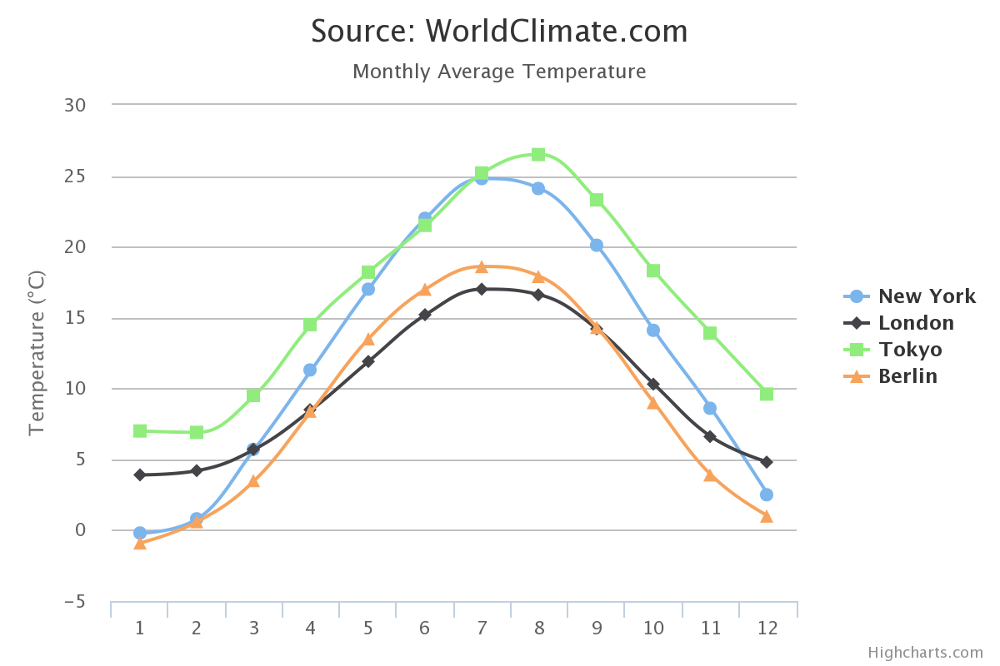
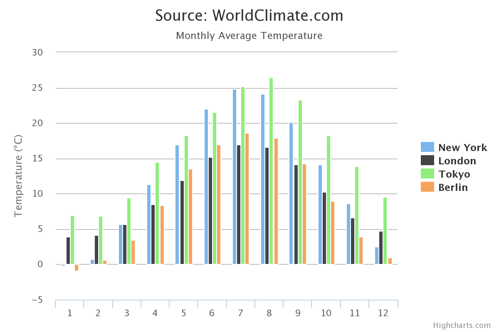
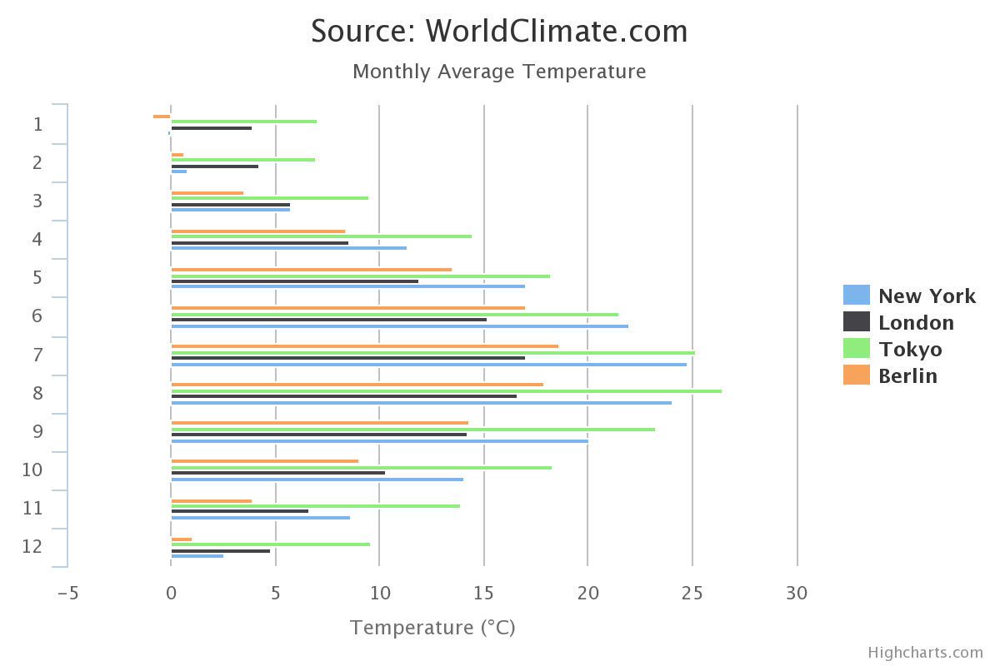

gochart
=======

[中文说明](http://blog.codeg.cn/2014/12/27/gochart-info/)

[gochart](https://github.com/zieckey/gochart) is a chart ploting tool which is simple to use. It used the open sources [golang](https://golang.org) and [highcharts](http://www.highcharts.com) which is modeled after [goplot](https://github.com/skoo87/goplot). It can plot spline/line/area/bar/column/pie. This tool is just a binary independent with any other lib or environment.

### Dependent

- [https://github.com/zieckey/goini](https://github.com/zieckey/goini)
- [https://github.com/bitly/go-simplejson](https://github.com/bitly/go-simplejson)


### Install from resource

- Install go
- Execute the command : `go get -u github.com/zieckey/gochart`

### Usage

* Download the binary tar.gz file and untar it. Enter the gochart directory, you can see an executable file `gochart` and some *.chart files. This chart files are the example data files. Execute the exe `gochart`, then you can open your browser and navigate to [http://localhost:8000](http://localhost:8000), and now you can see the charts.
* You can put `gochart` to your `PATH` environment and execute `gochart` in the directory which holds *.chart files. If you have several *.chart files, you can refresh the web page to plot diffrent chart.

### Example 1 : Spline data format 
  
This data format can be also used to plot line/bar/column/area when you can change the value of `ChartType`. The option value of `ChartType` is below : 

- spline
- line
- bar
- column
- area

```go
# The chart type , option : spline/line/bar/column/area
ChartType = spline
Title = Source: WorldClimate.com
SubTitle = Monthly Average Temperature
ValueSuffix = °C

# The height (px) of the chart
Height = 400

# The x Axis numbers. The count this numbers MUST be the same with the data series
XAxisNumbers = 1, 2, 3, 4, 5, 6, 7, 8, 9, 10, 11, 12

# The y Axis text
YAxisText = Temperature (°C)

# The data and the name of the lines
Data|Tokyo = 7.0, 6.9, 9.5, 14.5, 18.2, 21.5, 25.2, 26.5, 23.3, 18.3, 13.9, 9.6
Data|New York = -0.2, 0.8, 5.7, 11.3, 17.0, 22.0, 24.8, 24.1, 20.1, 14.1, 8.6, 2.5
Data|Berlin = -0.9, 0.6, 3.5, 8.4, 13.5, 17.0, 18.6, 17.9, 14.3, 9.0, 3.9, 1.0
Data|London = 3.9, 4.2, 5.7, 8.5, 11.9, 15.2, 17.0, 16.6, 14.2, 10.3, 6.6, 4.8
```


### Example 1 : Pie chart

```go
ChartType  = pie
Title 	   = Browser market shares at a specific website, 2014
SubTitle   = from website.com
SeriesName = Browser shares

# The data and the name of the pieces of the pie 
Data|Firefox = 45.0
Data|IE 	 = 26.8
Data|Chrome  = 12.8
Data|Safari  = 8.5
Data|Opera   = 6.2
Data|Others  = 0.7    
```

### Spline
<<<<<<< HEAD


### Pie


### Column


###　Area


### Line


### Bar

=======


### Pie


### Column


###　Area


### Line


### Bar

>>>>>>> d1ed0a437c116029e13d845f8edb8b25d2c78d33
